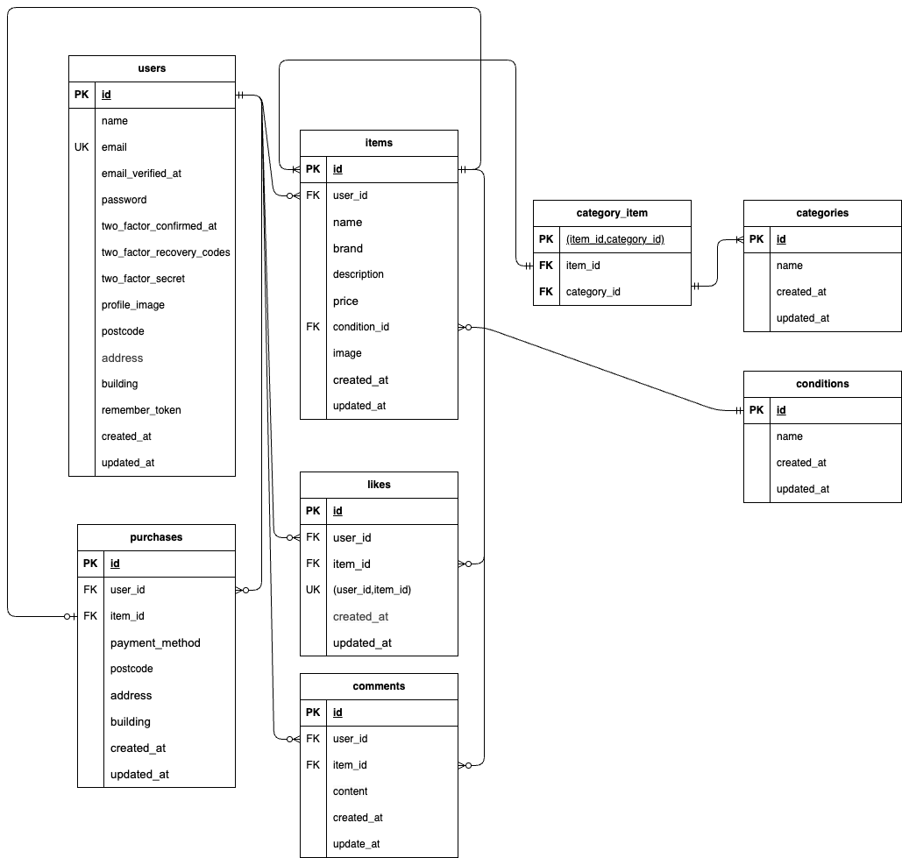

# coachtechフリマ

## 概要
ユーザーが商品を出品・購入できるフリマアプリです。
シンプルで使いやすいUIを意識し、商品検索・いいね・コメント・購入機能を実装しています。

---

## 機能一覧
- ユーザー登録 / ログイン / ログアウト
- メール認証機能
- 商品一覧表示
- 商品詳細表示
- 商品出品
- 商品検索機能
- いいね機能
- コメント機能
- 商品購入機能
- マイページ（出品商品・購入商品一覧）
- プロフィール編集機能（配送先住所変更含む）

---

## 環境構築

### Dockerビルド
```bash
git clone git@github.com:hana-ka/coachtech-flee-market.git

cd coachtech-flee-market

docker-compose up -d --build
```

### Laravel環境構築
```bash
docker-compose exec php bash
composer install
cp .env.example .env
```
.envファイルを以下のように設定してください
```env
DB_CONNECTION=mysql
DB_HOST=mysql
DB_PORT=3306
DB_DATABASE=laravel_db
DB_USERNAME=laravel_user
DB_PASSWORD=laravel_pass

MAIL_FROM_ADDRESS=test@example.com
```

※Stripeキーは環境に合わせて設定してください

```bash
php artisan key:generate
php artisan migrate
php artisan db:seed
```

## 使用技術（実行環境）

- PHP 8.x
- Laravel 8.x
- MySQL 8.0.26
- nginx 1.21.1
- Docker
- Docker Compose
- Git / GitHub

## 開発環境・ツール

- phpMyAdmin
- MailHog

## 外部サービス

- Stripe（商品購入時の決済機能に使用）

## ER図



## URL

- 開発環境：http://localhost/
- phpMyAdmin：http://localhost:8080/
- MailHog：http://localhost:8025/

## テスト

```bash
php artisan test
```

## 補足
- フォームリクエストを使用してバリデーションを実装しています
- メール認証はMailHogを使用しています
- 決済機能はStripeを使用しています（テスト環境では簡易処理に切り替えています）
- Featureテストを実装しています